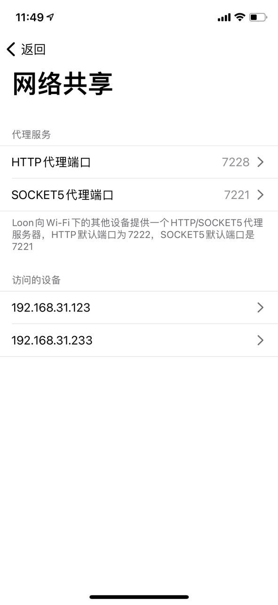

# 通过 PC 访问

## 简单说明


原理：PC 上运行的只是页面，页面通过发出跨域请求的形式操作 Surge 和 QuanX 中的数据！


### 第一步：配置运行环境

#### Surge Mac

> 要求在一台 mac 上操作（通过 PC 浏览器操作 Surge Mac 的数据，注意不是操作 Surge iOS 的数据）

1. 安装 [boxjs.rewrite.surge.tf.sgmodule](https://gitee.com/chavyleung/scripts/raw/master/box/rewrite/boxjs.rewrite.surge.tf.sgmodule) 模块
2. 重启 Surge 或 重载配置

#### QuanX

> 要求 PC 与 QuanX 在同一个局域网环境，通过 PC 浏览器远程操作 QuanX 的数据）


```bash
[http_backend]
https://gitee.com/chavyleung/scripts/raw/master/box/chavy.boxjs.js, tag=BoxJs.net, path=^/, enabled=false
```


1. 参考上图增加 **\[http\_backend\]** 配置
2. 设置 HTTP Backend 地址与端口（0.0.0.0:9999）
3. 重启 HTTP Backend 模块，重启代理（VPN）
4. 在 iOS 的系统设置里找到自己的局域网地址，如：192.168.50.100
5. 尝试访局域网地址：[http://192.168.50.100:9999](http://192.168.50.100:9999) 如果能进入 BoxJs 页面，则证明配置成功！

### Loon

> 直接设置网络共享的 HTTP 端口即可



### 第二步：下载&运行

1. 把 [chavy.boxjs.html](https://gitee.com/chavyleung/scripts/raw/master/box/chavy.boxjs.html) 下载到本地
2. 双击打开 HTML 文件
3. 在浏览器地址的 URL 地址后面，增加 baseURL 参数：

```bash
# Surge
# 在 URL 后面增加: ?baseURL=http://boxjs.net
# 完整示例：
 ​ file:///Users/chavy/chavy.boxjs.html?baseURL=http://boxjs.net

# QuanX
# 在 URL 后面增加：?baseURL=http://192.168.50.100:9999 
# 注意：192.168.50.100 是 QuanX 的局域网地址
# 完整示例：
 ​ file:///Users/chavy/chavy.boxjs.html?baseURL=http://192.168.50.100:9999

# 这时你应该能看到 BoxJs 的页面了

```


